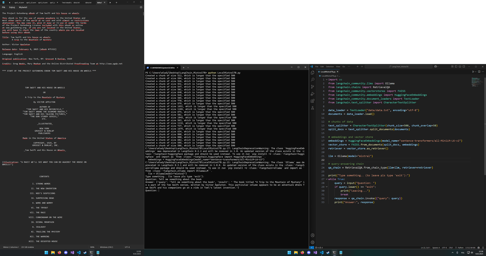

# LangChain + Mistral 7B 2025
Local data based Mistral 7B model

## Hardware Requirements for Mistral 7B

### Category: CPU
- **Minimum Requirements**: 8-core (Intel i7, AMD Ryzen 7)
- **Recommended Setup**: 12-core (Intel i9, Ryzen 9)
- **High-Performance Setup**: 16-core+ (AMD Threadripper)

### Category: GPU
- **Minimum Requirements**: RTX 3060 (12GB VRAM)
- **Recommended Setup**: RTX 3090 (24GB VRAM)
- **High-Performance Setup**: A100 (40GB VRAM)

### Category: RAM
- **Minimum Requirements**: 16GB DDR4
- **Recommended Setup**: 32GB DDR4
- **High-Performance Setup**: 64GB+ DDR5

### Category: Storage
- **Minimum Requirements**: 100GB SSD (SATA)
- **Recommended Setup**: 500GB SSD (NVMe)
- **High-Performance Setup**: 1TB+ NVMe SSD

### Category: OS
- **Minimum Requirements**: Linux (Ubuntu 20.04+) or Windows 10
- **Recommended Setup**: Linux (Ubuntu 22.04+), Windows 11
- **High-Performance Setup**: Linux (Ubuntu 22.04+, CentOS)

## Requirements
1. Install necessary libraries: `pip install langchain langchain_community faiss-cpu huggingface_hub ollama`
2. Install Mistral 7B model via Ollama

## Setup
1. Place your text file in `data/data.txt` with the content you want to query.
2. Run the script: `python LocalMistral7B.py`

## Usage
1. The program will prompt you to enter a question.
2. Type your question, and the system will return an answer based on the loaded document.
3. To exit, type `exit`.
